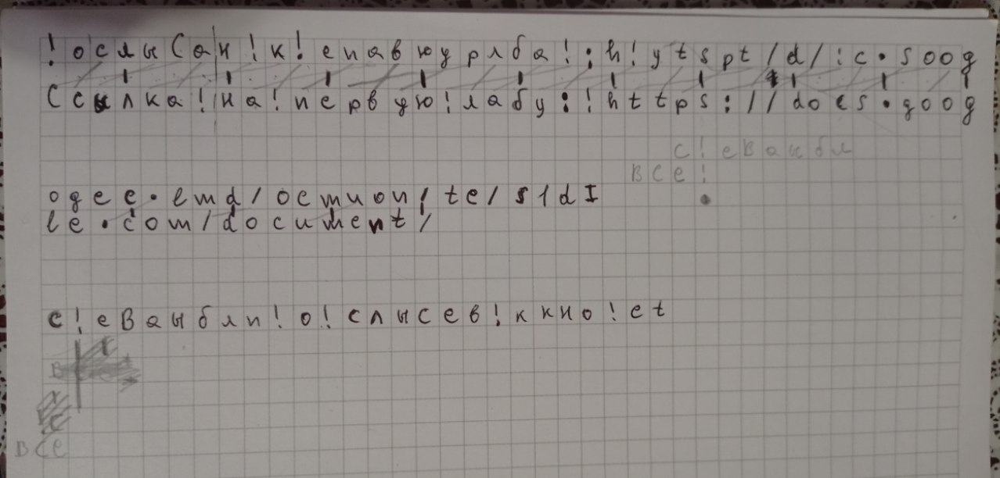

# Intro

Тут розміщений код та пояснення як я розшифрував intro-шифр.

### Пояснення

Хоч вихідний текст майже відразу з'явився у чаті, із цікавості я його розшифровував сам. Пояснення не читав. Взяв тільки дві підказки:

* є посилання
* `' '` замінено на `'!'`

Я відкрив шифр і просто почав дивитися на нього :) пробував знайти частини, які я точно знаю як розшифруються. Наприклад `https://google.com` або щось подібне. Мою увагу привернув цей рядок:

`!ослыСан!к!епавюурлба!:h!уtspt/d/:c.soogogec.lmd/ocmuon/te/s1`

Там просто можна прочитати `Ссылка на первую лабу: https://google.com/document/`. Я зробив висновок, що букви не замінені, а просто поміняні місцями. Я записав на листку шифр та результуючий текст. Почав шукати закономірність. Через деякий час знайшов:

Спочатку я побачив, що букви через три однакові у шифрі та вихідному тексті. Потім відносно цих букв шукав решту закономірностей.

### Реалізація

Реалізував на Rust (буквально декілька рядків коду). Тільки прийшлося у вхідному файлі замінити `'\n'` на `' '`. При нормальних знаках переносу рядка не працювало (точніше працювало чатково).

